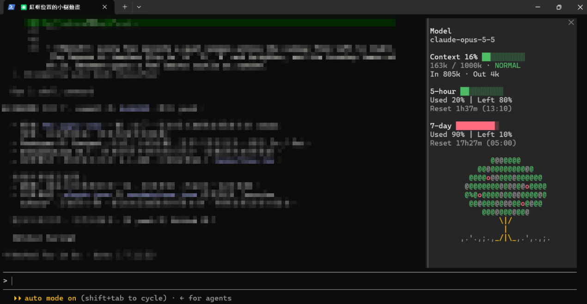

# Claude Code Usage Pane

A usage dashboard for Claude Code that docks on the right side of the terminal. It shows:

- the current model
- context usage
- 5-hour usage
- 7-day usage
- the percentage remaining on each limit
- a countdown to each limit's reset
- session token usage
- `WARNING` and `CRITICAL` states as context fills up

This repository is a Claude Code plugin marketplace named `claude-code-usage-pane`. It ships one plugin, `usage-pane`.

## Screenshots

<!-- Replace with real captures -->



## Features

- **Model**: the model the session is using.
- **Context**: percent used with a 10-cell bar, `tokens / window`, and a severity status:
  - `NORMAL` below 70%
  - `WARNING` from 70%
  - `CRITICAL` from 90%
- **5-hour and 7-day limits**: a bar, `Used X% | Left Y%`, and the time until reset (for example `Reset 2h14m (12:14)` or `Reset 3d0h (10/10 10:00)`).
- **Session**: context tokens, plus input and output tokens summed over main-loop turns. Subagent turns are excluded, and `/clear` resets the totals.
- Refreshes every 30 seconds and after each turn.
- Any value that isn't reported shows `Unavailable` instead of a guess.
- Adds a `/usage-pane` command that reopens the pane and reports where it's placed.

## Installation

Run these at the Claude Code prompt in a terminal session:

```
/plugin marketplace add tyda/claude-code-usage-pane
/plugin install usage-pane@claude-code-usage-pane
```

When asked, choose a scope. User scope is listed first.

## Usage

- The pane opens when a session starts. It docks on the right in the fullscreen layout once the terminal is at least 144 columns wide.
- Run `/usage-pane` to open it at any time. When you open it yourself, it docks from 110 columns.
- The footer line shows where the pane is placed: `placement: dock (right)` or `placement: inline (needs fullscreen)`.

## Compatibility

- Claude Code with function-hook plugin support (built and tested on 2.1.292).
- The pane docks only in the terminal's **fullscreen** layout. In the main-screen layout it opens inline.
- Draws on the `terminal` and `desktop` surfaces (both are covered by the tests).
- Rate-limit rows need an account that reports 5-hour and 7-day limits. Otherwise they show `Unavailable`.
- `/plugin install` runs in a terminal session. A plugin installed at user scope also loads in the desktop app's Code tab.

## Troubleshooting

| Symptom | Fix |
| --- | --- |
| Pane shows below the transcript instead of on the right | Set `"tui": "fullscreen"` (or use `/config`), restart, and make the terminal at least 110 columns wide. Running `/usage-pane` tells you the current layout and width. |
| Pane doesn't open at startup | Startup opening needs at least 144 columns. Widen the terminal or run `/usage-pane`. |
| 5-hour / 7-day rows show `Unavailable` | Your account or provider isn't reporting rate limits for this session. |
| Input / Output show `Unavailable` | No main-loop turn has finished yet since the session started or since `/clear`. |
| `Marketplace file not found` | Check that the repository is `tyda/claude-code-usage-pane` and that `.claude-plugin/marketplace.json` exists on the default branch. |
| `Plugin "usage-pane" not found in marketplace` | Install with `usage-pane@claude-code-usage-pane` exactly. |
| The plugin fails to load | Run `claude --debug` and look for lines beginning `usage-pane:`. |

## Development

From a clone of this repository:

```
claude --plugin-dir ./plugins/usage-pane
claude plugin validate plugins/usage-pane
claude plugin test plugins/usage-pane
```

## Repository layout

```
.claude-plugin/marketplace.json     marketplace manifest
plugins/usage-pane/
  .claude-plugin/plugin.json        plugin manifest
  hooks/hooks.json                  hooks module list
  hooks/register.tsx                pane, command and event hooks
  hooks/usage.ts                    severity and remaining-percentage helpers
  types/index.d.ts                  $.state contract
  tests/pane.test.tsx               plugin tests
```

## License

[MIT](LICENSE)
